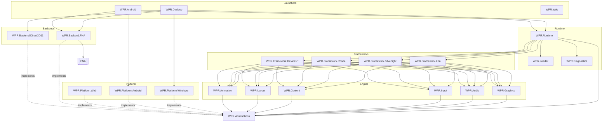

# WPR Architecture Migration Plan (ADR) — outstanding work

**Status:** In flight · **Trimmed to outstanding work 2026-08-30** · **Author:** Architecture

> This document is the contract for what is **left**. Stages 0–3 and sub-stages
> 5a–5e have landed; their narratives were removed on 2026-08-30 so the plan reads
> as a to-do list rather than a changelog. Recover the full record with
> `git show 2ce1cd2c:Plans/ARCHITECTURE-MIGRATION.md`. For what WPR looks like
> *today*, read [`Docs/ARCHITECTURE.md`](../Docs/ARCHITECTURE.md).
>
> **Section numbers are deliberately non-contiguous.** §1.3 and §3/§3.2 are cited
> from source comments (`WPR.Backend.Direct3D11.csproj`, the three
> `WPR.Framework.*.csproj` identity projects, `ApplicationPatcher.cs`), so those
> anchors survive even though their siblings went with the work that closed them.

## State of play in one paragraph

The XNA type system is WPR-owned and the frameworks and runtime are backend-clean.
`BackendIsolationTests.KnownBackendLeaks` is down to **two entries** —
`WPR.Platform.Windows` and `WPR.Platform.Android` — and both leak for the *same*
reason: FNA still owns the **spine** (`Game`, `GameComponent`,
`DrawableGameComponent`, `GameWindow`, `GraphicsDeviceManager`, `FNAPlatform`),
and the heads' tilt components derive from it. Everything remaining in Stage 5 is
that one problem, and it is gated on a product decision (§5, Stage 5f). Stages 6–8
have not started. Stage 4 left a real remnant: `WPR.Abstractions` and
`WPR.Diagnostics` are still largely **unconsumed scaffolding**.

---

## 1. Standing findings

*(1.1, 1.2 and 1.4 described the 2026-08-05 starting state and were removed with
the work that closed them.)*

### 1.3 Two backends, not one

WPR has **two live rendering backends**, and this remains a design constraint
rather than a historical note:

* **FNA** — the XNA game path (`Game`, `SpriteBatch`, `GraphicsDevice`).
* **Vortice.Direct3D11 + Avalonia** — the Silverlight path, behind
  `ISurfaceRendererBackend` / `IBackgroundRenderer`. It never touches FNA.

Any abstraction that claims to make the backend swappable must sit above *both*.
`WPR.Backend.FNA` and `WPR.Backend.Direct3D11` are the only two `AllowedReferrers`
in the fitness test, and the success criterion "backend can be replaced without
modifying Runtime or Frameworks" is only meaningful while that stays true.

---

## 2. Target dependency graph (the contract)



**Composition root = the launcher.** Only the launcher knows which concrete backend
and platform to inject. Runtime and Frameworks see only `WPR.Abstractions`.

**The one rule an automated gate enforces:** no project except `WPR.Backend.*` may
have an edge (project ref, package ref, or `using`) to `FNA` / `Vortice.*`. That is
`BackendIsolationTests`.

> **Naming conflict to resolve before Stage 7.** The graph reserves
> `WPR.Platform.Windows` / `WPR.Platform.Android` for the *platform-abstraction*
> layer and `WPR.Desktop` / `WPR.Android` for the launchers. The 2026-08-29
> dissolution of `Src/UI/WPR.UI` gave those `WPR.Platform.*` names to the
> **launcher heads** instead. Either the heads get renamed when the platform layer
> is extracted, or the platform layer needs different names. Decide it in Stage 7,
> not by accident.

---

## 3. Assembly identity — the rules that govern any further move

`ApplicationPatcher` keys every redirect by an **assembly identity string**
(`AssemblyNameReference.Parse("WPR.SilverlightCompability")`). Renaming an assembly
is therefore never cosmetic — it either updates a patcher string or breaks game
binding. Two categories, very different costs.

### 3.1 Patch-target shims — rename is cheap

`WPR.SilverlightCompability` (assembly `WPR.Framework.Silverlight`) is the only one
left. The patcher **rewrites** game IL to point here, so games never bind the name
themselves. Rename cost:

* update the `AssemblyNameReference.Parse(...)` fields + `NewNamespace` strings in
  `ApplicationPatcher.cs`,
* bump `ApplicationPatcher.Version`,
* reinstall all games.

**The pattern worth reusing** (established when `WPR.WindowsCompability` folded into
`WPR.Framework.Silverlight` at version 18): move the types but **keep their existing
namespace**, so type FullNames are identical before and after — every `NewNamespace`
string is untouched and only the `Reference` swaps.

**Load-bearing Cecil detail:** `module.AssemblyReferences.Add(...)` is **not**
redundant with setting `existingRef.Scope`. Cecil only assigns a metadata token to an
`AssemblyNameReference` registered on the module; an unregistered one gets
ResolutionScope 0 and the typeref silently binds to the game module itself.

### 3.2 Identity-binding assemblies — keep the WP7 name as the real implementation

`Microsoft.Phone`, `Microsoft.Devices.Sensors`, `System.Device`. The game references
`Microsoft.Phone` and resolves it **by simple-name identity** — the
assembly name *is* the public contract, named in IL typerefs, in Silverlight XAML
(`…;assembly=Microsoft.Phone`) and in reflection. The patcher does not rewrite these.

**Rule: don't rename the game-facing identity.** Organise the project under
`WPR.Framework.*` (folder + project name) and set the OUTPUT assembly name to the WP7
identity:

```xml
<!-- project: Core/WPR.Framework.Phone/WPR.Framework.Phone.csproj -->
<AssemblyName>Microsoft.Phone</AssemblyName>
```

The real implementation *is* the `Microsoft.Phone` assembly — no forwarder shim, no
patcher change, **no reinstall**, robust across IL + XAML + reflection (a forwarder
stub returns nothing from `GetTypes()`).

**The constraint — one assembly = one identity.** It cannot *merge* multiple game
identities into one DLL. Prefer **fewer shims over fewer assemblies**: Devices stays two
projects (`Microsoft.Devices.Sensors` + `System.Device`), mirroring real WP7's own split.

**The rule is not absolute — GamerServices was merged anyway** (2026-08-30, patcher
version 19): its 42 API types went into `WPR.Framework.Xna` and the patcher now rewrites
the assembly ref. That was accepted because the rewrite is at *assembly-ref* granularity
(three lines), not per-typeref. The price is the one to weigh next time: every
pre-version-19 install breaks until repatched, and **XAML or reflection naming the
assembly by string is not covered** — nothing in-tree does it, but a game could.

**Rejected alternatives, still rejected:** type-forwarder shim assemblies (a second DLL
plus a generation step per identity; the `scratchpad/fwdgen` tooling is retained but
unused), and expanding the patcher to rewrite every typeref (large, fragile,
reinstall-forcing).

**The no-redirect contract for moving a type out of FNA.** Every such move must: add the
moved FullNames to `ApplicationPatcher.WprFrameworkXnaTypes`, keep
`module.AssemblyReferences.Add`, bump `ApplicationPatcher.Version`, **reinstall all
games**, smoke-test. `WprFrameworkXnaTypes` is tested **before** `Patches`, so a FullName
in both silently loses its `Patches` redirect. The set is meant to stay an exact 1:1 with
`WPR.Framework.Xna`'s public XNA surface — no exclusions, no stale entries, no collisions.
It holds **244 entries** as of patcher version 19; if you move a type and those two counts
diverge, that is the bug.

---

## 5. What is left

Every stage's exit gate is the same (full checklist in [`STAGE-GATE.md`](STAGE-GATE.md)):
**(a)** both heads build; **(b)** the smoke pair — **Minesweeper** and **MonstaFish** —
launch to gameplay after reinstall; **(c)** `BackendIsolationTests` matches its baseline.

### Stage 4 remnant — the abstractions are scaffolding, not a seam

`WPR.Abstractions` was stood up in Stage 1 and has 13 files. **Two are live**: `IGameHost`
(`WPR.Backend.FNA.FnaGameHost`) and, since 2026-08-30, `ISensorProvider` — implemented by
both heads to split the accelerometer's keyboard-emulator and hardware paths out of
`Microsoft.Devices.Sensors`, where they had been fused behind `#if __ANDROID__`.
`IAudioDevice`, `IMusicPlayer`, `ISound`, `IInputProvider`, `IClipboard`, `IDisplay`,
`IFileDialog`, `IStorageProvider`, `IWindow` and `ITimer` still have **zero** consumers
anywhere in the tree. `WPR.Diagnostics` likewise has zero consumers — 37 files still log
through `WPR.Common.Log`.

The sensor split is the worked example for the rest: contract in `WPR.Abstractions`
(neutral vocabulary, no cycle), registry beside the consumer in the framework, one
implementation per head registered from `ServicesSetup.Start()`. See CLAUDE.md,
"Platform input".

The XNA layer solved the same problem a different way and it worked: **seven `WPR.Xna.Rhi`
seams behind a static `XnaBackend` registry**, not constructor-injected
`WPR.Abstractions` interfaces. So the open question is not "wire the abstractions up"
but:

* **Decide per interface: implement it, or delete it.** Dead interfaces in the linchpin
  project make the dependency graph look like an architecture that isn't there. The ones
  with a plausible future are the rest of the platform set (`IStorageProvider`,
  `IClipboard`, `IFileDialog`, `IDisplay`) — they are Stage 7's vocabulary, so they can
  legitimately wait; the audio/input trio is duplicated by `IAudioBackend` /
  `IInputBackend` and probably should go.
* **Migrate logging onto `WPR.Diagnostics`, or fold it back into `WPR.Common`.**
  Two logging stories, one of them used, is worse than either.
* **Promote the host.** `WPR.ApplicationLaunch` is still a `public static class` in
  `WPR.Backend.FNA` and `FnaGameHost` is a thin adapter over it: `Shutdown()` ==
  `RequestExit()`, and `Activated` / `Deactivated` are declared but **never raised**.
  Promote the static body onto the instance, split ALC/lifecycle coordination back into
  `WPR.Runtime` behind `IGameHost`, and make `Shutdown` a real `TeardownPhase`-ordered
  sequence. **Risk #1 lives here** — see §6.

### Stage 5 remnant — the baseline is not empty

**Exit criterion:** `KnownBackendLeaks` is empty. It currently holds two entries:

| Assembly | Backend | Cause (read out of the built IL) |
|---|---|---|
| `WPR.Platform.Windows` | FNA | `Game`, `GameComponent`, `DrawableGameComponent`, `GameWindow` — the tilt XNA components |
| `WPR.Platform.Android` | FNA | `Game` |

Both are the spine set and nothing else. `TiltInputXnaComponent` and
`TiltOverlayXnaComponent` are FNA `GameComponent`s living in the Windows head; they are
inherently backend code and should **relocate into `WPR.Backend.FNA`**, with the heads
keeping access through an orientation/overlay abstraction. That relocation is cheap on its
own but only clears the baseline once the spine question below is answered — a
`GameComponent` has to derive from *something*.

### Stage 5f — the spine (and the window-compositing product call)

**This is the gate on everything else in Stage 5.** What FNA still owns, 22 source files
in `Src/Backends/FNA.Platform/src`:

| Remaining in FNA | Files |
|---|---|
| Game loop + components | `Game`, `GameComponent`, `DrawableGameComponent`, `GameServiceContainer` |
| Window + device selection | `GameWindow`, `FNAWindow`, `GraphicsDeviceManager`, `GraphicsDeviceInformation`, `PreparingDeviceSettingsEventArgs` |
| Platform layer | `FNAPlatform`, `SDL2_FNAPlatform`, `TitleLocation`, `FNALoggerEXT` |
| Native bindings | `FNA3D.cs` (plus `FAudio` / `SDL2` / `Theorafile` compiled in from `lib/`) |
| Build/host glue | `FNADllMap`, `AssemblyHelper`, `XamarinHelper`, `AssemblyInfo`, `NamespaceDocs`, `WprActivationGuard`, `WprGameThread`, `WprPhoneBackButton` |

Two structural facts make this a different kind of work from the 5c resource lift, and
both are why it was deferred:

1. **FNA renders into its own top-level SDL window — there is no Avalonia bridge for the
   game path** (confirmed: no `D3D11Image`, shared texture or `SetParent` anywhere near
   it; Avalonia is only the launcher shell). Moving window ownership into WPR means
   *building* that bridge. **That is a product question, not a refactor:** keep the
   separate game window, or composite into the shell? Answer it before scoping the code.
2. The load-bearing teardown ordering lives in the spine's `ApplicationLaunch`
   finally-ladder (§6 Risk #1), so this stage and the Stage-4 host promotion are the same
   piece of work approached from two directions.

Until it lands, `Microsoft.Xna.Framework.Game` remains a **backend-defined game-facing
identity** (the patcher rescopes game `Game` refs to FNA), so "games bind only WPR-owned
identities" holds for the entire XNA type system but not for the spine set — chiefly
`Game`, `GameWindow` and `GraphicsDeviceManager`, plus the deliberate
`GraphicsDeviceManager2` / `GraphicsDevice2` / `GraphicsAdapter2` behaviour-override shims.

The design rules that carry into this stage are in
[`STAGE5C-SCOPE.md`](STAGE5C-SCOPE.md).

* **Exit:** `KnownBackendLeaks` empty; green build; smoke pair launches. *That is also the
  whole of Stage 5's exit.*

### Stage 6 — Extract Engine projects

Not started; none of these projects exist yet.

* Move reusable rendering/scene/text/audio-graph/input-routing/measure-arrange/storyboard
  logic out of the frameworks into `WPR.Graphics`, `WPR.Audio`, `WPR.Input`,
  `WPR.Content`, `WPR.Layout`, `WPR.Animation` — all speaking only `WPR.Abstractions`.
* Frameworks become thin API-surface adapters over the engine.
* **Exit:** green build; smoke pair; engine projects have zero FNA edges (fitness test
  extended to cover them).

### Stage 7 — Reduce backends to pure adapters + extract Platform

Not started. Note the launcher heads were *named* `WPR.Platform.Windows` /
`WPR.Platform.Android` on 2026-08-29 without the platform layer being extracted — see the
naming conflict note under §2.

* `WPR.Backend.FNA` / `WPR.Backend.Direct3D11` contain **only** interface
  implementations — no Phone/Silverlight/Devices/app logic. Today `WPR.Backend.FNA` still
  holds `ApplicationLaunch` (app logic) and `Compat/GamerServicesComponent`.
* Extract the real platform layer (`IStorageProvider`, `ISensorProvider`, `IClipboard`,
  `IFileDialog`, `IDisplay`, raw input) out of the launcher heads.
* Settle the launcher-vs-platform naming.
* **Exit:** green build; smoke pair; backends provably content-free of app logic.

### Stage 8 — New platforms/backends (post-migration, optional)

`WPR.Platform.Web` + `WPR.Web` (browser canvas/gamepad/storage), `WPR.Platform.Linux`,
`WPR.Platform.macOS`. Purely additive — implement the same interfaces.

---

## 6. Risk register (live risks only)

| Risk | Impact | Mitigation |
|---|---|---|
| **#1 Teardown-ordering regressions** | ALC-unload failure, audio keeps playing, duplicate static keys | `ApplicationLaunch.cs` reaches FNA internals by reflection (`MediaPlayer.DisposeIfNecessary`, `SoundEffect.FAudioContext`, `ContentTypeReaderManager` cache clear) in a strict order that exists to fix real bugs, and the `XnaBackend` registry added on top holds native-adjacent state that must be cleared at the right point or it pins the ALC. Any change here needs a **launch→exit→relaunch** cycle, not just a launch. `IGameHost.TeardownPhase` encodes the order — honour it. |
| Spine / window compositing | The one piece that can't be staged as a leaf-swap | Answer the product question first (§5, Stage 5f); don't start the code until the window decision is made |
| XNA render-path correctness | Games bind by identity; a `SpriteBatch`/`Effect`/state bug renders wrong *everywhere* | Keep changes mechanical leaf-swaps; smoke pair every step |
| Patcher table drift vs installed IL | "Same error after reinstall" | Bump `ApplicationPatcher.Version`; verify `.dll.original` is newer than the patcher edit (CLAUDE.md) |
| Assembly rename breaks game binding | Every installed game `FileNotFoundException` | §3 — keep the identity, or update the patcher string + `Version` + reinstall |
| Two-TFM breakage (`net8.0-windows` / `net8.0-android`) | Android leg silently drops | Every new project multi-targets both; the stage gate builds Android per the CLAUDE.md recipe |
| RHI chattiness | Perf | Keep the seam draw-call-grained, never per-vertex |
| "Big-bang" temptation | Broken build for weeks | Hard rule: no stage merges without green build + smoke pair |

---

## 7. Success-criteria traceability (unmet only)

Met and removed from this table: *Runtime has no FNA references* and *Frameworks have no
FNA references* — both hold as of 2026-08-30; the residual leaks are in the launcher heads.

| Spec success criterion | Achieved at |
|---|---|
| Engine has no FNA references | Stage 6 |
| Platform code isolated | Stage 7 |
| Backend replaceable without touching Runtime/Frameworks | Stage 7 (both backends behind abstractions) |
| Every project single responsibility | Stage 7 |
| Games bind only WPR-owned identities | Stage 5f (spine) |
| WP APIs source-compatible | Standing invariant — preserved via the namespace + identity rules in §3 |

---

## 8. Standing decisions

Locked and still binding:

1. **Keep the WP7 assembly identity; don't use forwarder shims** (§3.2). Departures are
   allowed but must be recorded as such, with the cost named — as GamerServices was.
2. **`WPR.Backend.Direct3D11` is a first-class peer backend** (§1.3). Abstractions sit
   above both it and FNA.
3. **Achievements are a service behind `IAchievementStore`**, not a framework concern. The
   seam lives in `WPR.Framework.Xna` (its vocabulary is the game-facing `Achievement`
   type); `WPR.Database` implements it.
4. **Green-gate smoke pair — Minesweeper and MonstaFish.** Both must reach gameplay after
   reinstall at every stage's exit.
5. **Scope boundary held at the type system.** 5c lifted Graphics/Audio/Media/Content/Input
   behind seams and left the spine in `WPR.Backend.FNA`; the spine is its own stage, gated
   on the window-compositing call.
