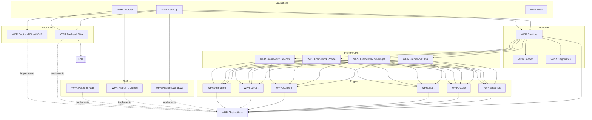

# WPR Architecture Migration Plan (ADR)

**Status:** Draft for approval · **Date:** 2026-08-05 · **Author:** Architecture
**Decisions locked with product owner:**

1. First deliverable is this written plan — **no code changes until approved**.
2. Assembly strategy is **clean rename + reinstall-all** — assembly names move to
   the new architecture, `ApplicationPatcher` tables are updated to match, and
   "reinstall every installed game once" is an accepted one-time cost.

> This document is the contract for the migration. It is grounded in the current
> repo (not the idealized spec): every "current state" claim below was read out of
> the actual `.csproj` graph and `ApplicationPatcher.cs` on the date above.

---

## 1. Where the repo actually is today

The target layers from the spec **already exist in de-facto form** — they are just
mis-named and, critically, the dependency edges run the wrong way (FNA leaks
upward into the framework and runtime layers).

### 1.1 Project inventory → target mapping

| Spec target | Exists today as | Action |
|---|---|---|
| `WPR.Runtime` + `WPR.Loader` + `WPR.Diagnostics` | **`WPR`** — one project: XAP scan/install (`LibraryScanner`, `ApplicationInstaller`), IL patching (`ApplicationPatcher`), assembly synthesis (`WinmdStubber`, `WindowsTypeSynthesizer`, `WinRtRefStripper`), launch/host (`ApplicationLaunch`, `SilverlightAppHost`), EF-Core catalogue DB (`Models/`, `Migrations/`) | **Split into 3**; sever FNA + XNA-facade refs |
| `WPR.Abstractions` | — does not exist — | **Net-new** (the linchpin) |
| `WPR.Common` | `WPR.Common` | Keep |
| `WPR.Framework.Silverlight` | `WPR.SilverlightCompability` (already mirror-tree; renders via **Vortice/D3D11 + Avalonia**, *no FNA*) | Rename + point rendering at Engine |
| `WPR.Framework.Phone` | `Microsoft.Phone` | Rename (identity-binding — see §3) |
| `WPR.Framework.Devices` | `Microsoft.Devices` + `Microsoft.Devices.Sensors` + `System.Device` | Consolidate + add `ISensorProvider`; drop FNA |
| `WPR.Framework.Xna` | `XnaFacades/Microsoft.Xna.Framework.*` (10 projects) + `Microsoft.Xna.Framework.GamerServices` | Consolidate; **these are the FNA leak**; split GamerServices (see §1.3) |
| Engine: `WPR.Graphics` `WPR.Audio` `WPR.Input` `WPR.Content` `WPR.Layout` `WPR.Animation` | — none — (logic is inline in the frameworks + FNA today) | **Net-new**, filled by extraction in Stage 6 |
| `WPR.Platform.Windows` / `.Android` | logic inline in `WPR.UI.Desktop` / `WPR.UI.Android` | **Extract** |
| `WPR.Platform.Web` / `.Linux` / `.macOS` | — none — | **Net-new**, Stage 8 |
| `WPR.Backend.FNA` | `ThirdParty/fna` referenced *directly by everyone* | **Wrap** behind adapter |
| `WPR.Desktop` / `WPR.Android` / `WPR.Web` | `WPR.UI.Desktop` / `WPR.UI.Android` (+ shared `WPR.UI`) | Rename; `Web` net-new |
| `WPR.Tests` | `WPR.SilverlightCompability.Tests` | Broaden |
| — patch helper — | `WPR.XnaCompability` (patch-target shim lib) | Fold into Runtime/Loader; keep as shim assembly |

### 1.2 The FNA leak, concretely

`FNA.Core.csproj` is referenced **directly** by, and must be severed from:

```
WPR                                     (the runtime core)          ❌
Microsoft.Xna.Framework                 (facade)                    ❌
Microsoft.Xna.Framework.Game            (facade)                    ❌
Microsoft.Xna.Framework.Graphics        (facade)                    ❌
Microsoft.Xna.Framework.Audio           (facade)                    ❌
Microsoft.Xna.Framework.Content         (facade)                    ❌
Microsoft.Xna.Framework.Input           (facade)                    ❌
Microsoft.Xna.Framework.Input.Touch     (facade)                    ❌
Microsoft.Xna.Framework.Media           (facade)                    ❌
Microsoft.Xna.Framework.GamerServices                               ❌
Microsoft.Devices.Sensors                                           ❌
WPR.XnaCompability                      (patch target lib)          ❌
```

Plus two leaks the Stage-0 fitness test surfaced that a `.csproj` grep misses —
no direct FNA `ProjectReference`, but FNA types flow through the `WPR` core and
are used in their IL:

```
WPR.UI                  (shared UI)   — burn down; should be FNA-free            ❌
WPR.UI.Android          (launcher)    — moves to allowed referrers as WPR.Android
```

> **Update (2026-08-29):** the `WPR.UI` project was dissolved — the Avalonia UI and
> the launchers moved into `WPR.Platform.Windows`, the handful of pieces both heads
> needed were copied into both, and the unused remainder was deleted. Its FNA edge
> moved with the launchers, so the live baseline in `BackendIsolationTests` reads the
> two platform heads by **assembly** name.
>
> Later the same day **both** heads' assemblies were renamed to match their projects —
> `WPR.UI.Desktop` → **`WPR.Platform.Windows`** and `WPR.UI.Android` →
> **`WPR.Platform.Android`** — and the baseline entries moved with them. Project and
> assembly now agree for every project in `Platforms/`.
>
> The two renames carried very different risk, which is worth recording:
>
> * **Windows was load-bearing in three places that fail silently rather than loudly.**
>   Avalonia `avares://` authorities are the **assembly** name (all 12 URIs in the head
>   moved, including the ones the XAML compiler generates), `Packaging/windows/WPR.iss`
>   installs and shortcuts the exe by filename, and `release.yml` asserts the published
>   exe exists. Because the Inno `AppId` is deliberately stable, an upgrade lands in the
>   same `{app}`, so `WPR.iss` gained an `[InstallDelete]` sweeping the old
>   `WPR.UI.Desktop.*` payload out rather than leaving two launchable exes side by side.
>   Toasts were unaffected: the AUMID and Start Menu `.lnk` come from the
>   `WindowsAppDisplayName` constant and never tracked the exe filename.
> * **Android was nearly inert**, because nothing user-facing keys off the assembly name:
>   the apk/package identity is the manifest `package` (`com.wpr.android`), every real
>   activity pins its Java class name with `[Register("com.wpr.android.X")]` so no ACW
>   moved, `release.yml` globs `*-Signed.apk`, and `Properties/Resources` resolves through
>   `$(RootNamespace)`, which already matched. The only hash-derived ACW
>   (`crc64….SplashActivity`) belongs to a class nothing references.

Only `WPR.Backend.FNA` / `WPR.Backend.Direct3D11` (and the concrete launcher
composition roots) are permitted to keep a backend edge at the end.

### 1.3 Finding: two backends, not one

The spec names a single `WPR.Backend.FNA`. In reality there are **two live
rendering backends**:

* **FNA** — the XNA game path (`Game`, `SpriteBatch`, `GraphicsDevice`).
* **Vortice.Direct3D11 + Avalonia** — the Silverlight path. `WPR.SilverlightCompability`
  references `Vortice.Direct3D11 / DXGI / D3DCompiler` and renders through a D3D11
  image bridge. **It never touches FNA.**

**Consequence for the design:** the `WPR.Abstractions` graphics contracts
(`IGraphicsContext`, `ITexture`, `IRenderTarget`, …) must sit above *both*, and
we will need a second adapter — `WPR.Backend.Direct3D11` — as a peer of
`WPR.Backend.FNA`. The success criterion "Backend can be replaced without
modifying Runtime or Frameworks" is only meaningful once the Silverlight renderer
is also behind the abstraction. This is added scope the spec omits; flag for
approval.

### 1.4 Finding: GamerServices is two concerns fused

`Microsoft.Xna.Framework.GamerServices` today contains **both** the XNA
GamerServices *API surface* **and** the TrueAchievements *backend* (it pulls in
`ExCSS`, `HtmlAgilityPack`, `EntityFrameworkCore.Sqlite` — a web scraper + DB).
Under the target these split:

* API surface → `WPR.Framework.Xna` (GamerServices namespace).
* Achievements scraper + DB → a **Runtime service** behind an interface
  (`IAchievementStore`), consumed via DI. Not a framework concern.

---

## 2. Target dependency graph (the contract)



**Composition root = the launcher.** Only `WPR.Desktop` / `WPR.Android` / `WPR.Web`
know which concrete backend + platform to inject. Runtime and Frameworks see only
`WPR.Abstractions` interfaces. This is what makes the backend swappable.

**The one rule an automated gate can enforce:** no project except `WPR.Backend.*`
may have an edge (project ref, package ref, or `using`) to `FNA` / `Vortice.*`.
We add this as a build check in Stage 4 (see §5).

---

## 3. Assembly identity — the load-bearing detail behind "clean rename"

`ApplicationPatcher` keys every redirect by an **assembly identity string**
(`AssemblyNameReference.Parse("WPR.SilverlightCompability")`). Renaming an
assembly is therefore not a cosmetic change — it either updates a patcher string
or breaks game binding. There are two categories, and they have very different
rename costs:

### 3.1 Patch-target shims — rename is cheap

`WPR.SilverlightCompability` (assembly `WPR.Framework.Silverlight`) is now the only one
left. The patcher **rewrites** game IL to point here, so the game never binds to these
names on its own. Rename cost:

(Three siblings were dissolved into it or into the XNA layer. `WPR.XnaCompability` went to
`WPR.Framework.Xna` / `WPR.Backend.FNA` at patcher version 16; `WPR.StandardCompability`
went to `WPR.WindowsCompability` at 17; and `WPR.WindowsCompability` itself went to
`WPR.Framework.Silverlight` at 18. The last one is the pattern worth reusing: all 17 types
**kept their `WPR.WindowsCompability` namespace** and only changed host assembly, so every
`NewNamespace` string in the patcher was untouched and only `Reference` swapped to
`SilverlightCompRef`. Type FullNames were identical before and after — the precedent was
already set by `ResourceDictionary`, which had been moved that way earlier behind a
`[TypeForwardedTo]`.)

Note the load-bearing detail if you repeat this: `module.AssemblyReferences.Add(...)` is
**not** redundant with setting `existingRef.Scope`. Cecil only assigns a metadata token to
an `AssemblyNameReference` that is registered on the module; an unregistered one gets
ResolutionScope 0, and the typeref silently binds to the game module itself.

* update the ~7 `AssemblyNameReference.Parse(...)` fields + `NewNamespace` strings
  in `ApplicationPatcher.cs`,
* bump `ApplicationPatcher.Version`,
* reinstall all games.

### 3.2 Identity-binding assemblies — keep the WP7 name as the real implementation

`Microsoft.Phone`, every `Microsoft.Xna.Framework.*`, `Microsoft.Devices.Sensors`,
`System.Device`. The game references e.g. `Microsoft.Xna.Framework, Version=4.0` and
resolves it **by simple-name identity** — the assembly name *is* the public contract,
exactly like the namespace, and it is named not only in IL typerefs but in Silverlight
XAML (`…;assembly=Microsoft.Phone`) and reflection. The patcher does **not** rewrite most
of these. A blind rename to `WPR.Framework.*` would make every unpatched reference fail
with `FileNotFoundException`.

**Resolution (revised 2026-08-06, superseding the type-forwarder plan below):
don't rename the game-facing assembly identity at all.** Organise the project in the
`WPR.Framework.*` layer (folder + project name), but set the OUTPUT assembly name to the
WP7 identity:

```xml
<!-- project: Core/WPR.Framework.Phone/WPR.Framework.Phone.csproj -->
<AssemblyName>Microsoft.Phone</AssemblyName>
```

The **real implementation *is* the `Microsoft.Phone` assembly** — games bind it directly.
No forwarder shim, no `ApplicationPatcher` change, **no reinstall**, and it is robust across
IL + XAML + reflection because the identity is a real, fully-populated assembly (a forwarder
stub, by contrast, returns nothing from `GetTypes()`). Project name ≠ assembly name is
deliberate: clean layer organisation *and* preserved WP7 identity. This is simpler than
forwarders (one DLL, no generated `Forwarders.cs`, no regen step).

**The one constraint — one assembly = one identity.** This is per-identity, so it cannot
*merge* multiple game identities into a single DLL. Where the ADR earlier said "consolidate"
(Devices; the 10 XNA facades), that would force renaming → forwarders. We prefer **fewer
shims over fewer assemblies**, so those stay as one project per game identity (e.g. Devices =
`WPR.Framework.Devices.Sensors` → `Microsoft.Devices.Sensors` + `WPR.Framework.Devices.Location`
→ `System.Device`, two assemblies, zero forwarders — mirroring real WP7's own split).

#### Departure: GamerServices was merged anyway (2026-08-30, patcher version 19)

`Microsoft.Xna.Framework.GamerServices` **no longer exists as an identity.** Its 42 API types
were folded into `WPR.Framework.Xna`, and `GamerServicesComponent` — the only type deriving from
FNA's spine `GameComponent` — into `WPR.Backend.FNA/Compat/`, mirroring `GraphicsDeviceManager`
at version 15. This is a deliberate departure from the rule above; record it as such rather than
reading the rule as still absolute.

What it cost, i.e. what the rule was protecting:

* The patcher now **rewrites** the `Microsoft.Xna.Framework.GamerServices` (and
  `…GamerServicesExtensions`) assembly refs to `WPR.Framework.Xna`, where before it deliberately
  left them alone. That is the "expand the patcher to rewrite every typeref" option this ADR
  rejects elsewhere — accepted here only because the rewrite is at *assembly-ref* granularity
  (three lines), not per-typeref.
* Every pre-version-19 install fails at launch until repatched. All 16 test installs named the
  old identity.
* Any XAML or reflection naming the assembly by string is **not** covered, per the warning above.
  Nothing in-tree does, but a game could.

What it bought:

* `Microsoft.Xna.Framework.GamerServices → FNA` was the last real entry in the
  `BackendIsolationTests` leak baseline (its comment read "de-FNA is Stage 5d"). Moving the one
  FNA-derived type into the backend closed it; the test now passes with that entry deleted.
* GamerServices no longer reaches into the Silverlight layer. It read
  `Application.Current.ProductId` off the `WindowsCompability.Application` shim; that moved to
  `WPR.Common.WprHostEnvironment.CurrentProductId`, so the XNA layer needs no Avalonia.
* Two FNA helpers it *did* call — `WprGameThread.Post` and
  `WprActivationGuard.SuppressFocusActivation` — became slots on `XnaBackend`
  (`SetGameThreadPost` / `SetSuppressFocusActivation`), filled by `FnaGameHost`. A reference to
  FNA.Core was not merely undesirable here but **impossible**: FNA.Core references
  `WPR.Framework.Xna`, so it would have been a circular project reference.

> **Superseded approach (kept for context):** the original plan left behind thin identity-named
> **type-forwarder shim assemblies** (`[assembly: TypeForwardedTo(typeof(...))]`, one per public
> type, auto-generated by reflecting the built impl — see `scratchpad/fwdgen`). That also
> preserves binding with no reinstall, but adds a second DLL + a generation step per identity;
> its only unique capability is merging N identities into one impl DLL, which we've chosen not to
> use. Forwarders were built for Phone + Devices on 2026-08-05/06, then removed on 2026-08-06 in
> favour of the AssemblyName approach. The remaining alternative — expanding the patcher to
> rewrite every typeref — stays rejected (large, fragile, reinstall-forcing).

---

## 4. Sequencing principle: abstractions before the moves

The spec's stage order (move namespaces 1–3, *then* introduce abstractions 4,
*then* replace FNA 5) is unsafe to execute literally, because the framework
projects **cannot compile without FNA types** until the abstractions exist — their
public surface (`Vector2`, `Matrix`, `Color`, `GraphicsDevice`, `SpriteBatch`) *is*
FNA today. Moving them first just relocates the forbidden edge.

**Re-sequenced so every stage ends green:**

* Stages 1–3 (regroup/rename) are done **with the FNA edge temporarily intact** —
  legal because the migration is incremental; the edge is removed later.
* `WPR.Abstractions` is introduced **early (Stage 4)**, but the FNA severance
  (Stage 5) and Engine extraction (Stage 6) are where the real work and risk live.

Think of it as: **1–3 = plumbing (low risk, mechanical), 4–7 = the actual
architecture (high risk, real code).**

---

## 5. Staged plan — each stage ends with a green build + passing smoke test

Every stage's exit gate is the same (full checklist in `Plans/STAGE-GATE.md`):
**(a)** `WPR.Platform.Windows` builds for `net8.0-windows10.0.17763.0` and the Android
leg builds per the CLAUDE.md recipe; **(b)** the two smoke titles — **Minesweeper**
and **MonstaFish** — launch to gameplay after reinstall; **(c)** the
`BackendIsolationTests` fitness test matches its documented baseline.

### Stage 0 — Safety net (prerequisite, no structure change) · ✅ landed 2026-08-05
* Add a **dependency-fitness test** to `WPR.Tests`: reflectively assert that no
  assembly outside `WPR.Backend.*` references `FNA` or `Vortice.*`. It fails today —
  that's fine; it becomes the green light for Stage 5 and the guard forever after.
* Pin a **smoke-test pair** (one XNA title, one Silverlight title) as the
  per-stage acceptance check.
* **Exit:** test project runs; fitness test present (expected-fail annotated).

### Stage 1 — `WPR.Abstractions` + `WPR.Diagnostics` scaffolding (net-new, zero moves) · ✅ landed 2026-08-05
Introduce the linchpin project first, empty of dependencies, so later stages have
somewhere to point. (Delivered: 19 interface/DTO files across Graphics/Audio/Input/
Sensors/Platform/Timing/Hosting/Achievements + a 5-file diagnostics sink. Both build
clean for net8.0; fitness test still green.)
* Create `WPR.Abstractions` with the interface set: `IGraphicsContext`,
  `IRenderTarget`, `ITexture`, `IShader`, `IFont`, `IWindow`, `IAudioDevice`,
  `ISound`, `IMusicPlayer`, `IInputProvider`, `IStorageProvider`, `ISensorProvider`,
  `IClipboard`, `IFileDialog`, `ITimer`, `IDisplay`, `IAchievementStore`, and
  **`IGameHost`** — a game-loop/lifecycle contract with **explicit teardown-ordering
  hooks** (added after the Stage-5 audit; the reflective dispose ordering in
  `ApplicationLaunch.cs` has no equivalent otherwise — see `Plans/STAGE5-SIZING.md`
  Risk #1).
* **Owned value types are a separate workstream, not interfaces.** The XNA math
  types (`Vector2/3/4`, `Matrix`, `Quaternion`, `Color`, `Rectangle`, `Point`, …)
  plus `PlayerIndex` / `DisplayOrientation` / `StorageDevice` are value types/enums
  games pass by value/identity and **cannot** be abstracted — they must become
  WPR-owned concrete types under the `Microsoft.Xna.Framework` namespace (vendor
  FNA's MIT math). This is Stage 5's critical-path prerequisite (Stage 5a).
* Extract logging/tracing (`wpr_game_debug.log` etc.) into `WPR.Diagnostics`.
* Nobody depends on these yet.
* **Exit:** both projects compile; solution unchanged behaviourally.

### Stage 2 — Split `WPR` → `WPR.Runtime` + `WPR.Loader` · ✅ landed 2026-08-05
File move within one solution, no game-facing-identity impact (games never bind to
the `WPR` assembly — verified: no `Assembly.Load("WPR")` anywhere). `namespace WPR`
is **preserved across both assemblies**, so no consumer source changed (only 3
`.csproj` ref edits + one `internal`→`public`).
* `WPR.Loader` (21 files) ← `LibraryScanner`, `ApplicationInstaller`,
  `ApplicationPatcher`, `WinmdStubber`, `WindowsTypeSynthesizer`, `WinRtRefStripper`,
  `AssemblyNameStandardization` (made `public`), `UnityPortManifest`, `GameMakerWin*`,
  `GameMakerAchievementExtractor`, EF `Models/` + `Migrations/` (catalogue DB).
* `WPR.Runtime` (4 files) ← `ApplicationLaunch`, `SilverlightAppHost`,
  `GameMakerLauncher`, `GameMakerAchievementBridge`. References `WPR.Loader` (+ FNA/
  XNA/GamerServices/Phone, removed later). **Abstractions/Diagnostics wiring deferred
  to Stage 4** — Stage 2 is purely the split.
* **Deviation from §1.4 forced by the acyclicity check:** `XnaAchievementSeeder`,
  `HardcodedAchievementCatalogue`, and `AudioCompabilityConverter` had to go to
  `WPR.Loader` (the install pipeline calls them), not `WPR.Runtime`. The
  achievements-store extraction behind `IAchievementStore` remains Stage 5e; Stage 2
  only relocates these files to keep the graph acyclic (Runtime → Loader).
* FNA + XNA-facade refs **stay in `WPR.Runtime` for now** (removed in Stage 5b).
* **Verified:** both new projects build for `net8.0-windows` (0 errors); fitness test
  green with baseline `WPR`→`WPR.Runtime` (Loader is FNA-clean). No reinstall needed.
  Full solution + Android leg is the Rider gate.

### Stage 3 — Rename frameworks to `WPR.Framework.*` (identity kept via AssemblyName, §3.2) · ⏳ in progress
**Sub-progress:** ✅ `WPR.SilverlightCompability` → `WPR.Framework.Silverlight` (2026-08-05):
patch-target, no forwarders; namespace kept `WPR.SilverlightCompability`; patcher
`SilverlightCompRef` string updated + `Version` bumped 1→2 (reinstall-forcing); 3
referencers repointed; builds green + fitness green.
✅ `Microsoft.Phone` (2026-08-06, final). Project organised as `WPR.Framework.Phone` but
`<AssemblyName>Microsoft.Phone</AssemblyName>` — the real impl **is** the `Microsoft.Phone`
assembly (§3.2), so games (IL + XAML) bind it directly: **no forwarder, no patcher change, NO
reinstall.** (History: a `WPR.Framework.Phone`-named impl + a separate `Microsoft.Phone` forwarder
shim were built 2026-08-05, then the shim was deleted 2026-08-06 and the impl's AssemblyName set to
`Microsoft.Phone` — same binding, one fewer DLL, no `fwdgen`.) `WPR.Framework.Silverlight`'s
`[InternalsVisibleTo]` grant tracks the *assembly* name, so it reads `"Microsoft.Phone"` (IVT matches
assembly, not project). Tests reference the `WPR.Framework.Phone` *project* (unchanged). Builds both
TFMs → `Microsoft.Phone.dll`; `WPR.Runtime` builds through it; fitness green. (A pre-existing, unrelated
`ImageTests.cs` compile error in the SL test project surfaced — byte-identical to HEAD, not caused here.)
✅ Devices (2026-08-06, final). **Two** game identities, so **two** projects, **zero** forwarders
(§3.2 — one assembly = one identity; not consolidated into a single DLL, which would force forwarders):
`WPR.Framework.Devices.Sensors` → `<AssemblyName>Microsoft.Devices.Sensors</AssemblyName>` (Sensors code,
refs FNA for `Vector3`) and `WPR.Framework.Devices.Location` → `<AssemblyName>System.Device</AssemblyName>`
(GeoLocation code, FNA-free). Both are the real impls games bind directly ⇒ **no patcher change, NO
reinstall**. (History: briefly consolidated into one `WPR.Framework.Devices` + two forwarder shims on
2026-08-06, then un-consolidated the same day to drop the shims.) Fitness baseline: `Microsoft.Devices.Sensors` was listed as an
FNA leak until Stage 5d cleared it on 2026-08-29; both it and `System.Device` are now clean. The empty-orphan `Microsoft.Devices` project
(`Src/Microsoft.Devices`) was **removed** (no game binds a `Microsoft.Devices` *assembly*; those
namespace types live in `Microsoft.Phone`, per real WP7). Both TFMs build → `Microsoft.Devices.Sensors.dll`
+ `System.Device.dll`; `WPR.Runtime` builds through both; fitness green.
**Net after the pivot: every forwarder shim is gone** — Phone/Devices identities are now real impls
named by `<AssemblyName>`, projects organised under `WPR.Framework.*`. `scratchpad/fwdgen` is retained
but unused by the current approach.
✅ XNA re-scoped into Stage 5 (not a Stage-3 wholesale rename). Owner directive: **don't consolidate
the 10 facades into one renamed assembly** (that structurally needs forwarders — XNA is one interlocking
impl behind 10 game identities). Instead, `WPR.Framework.Xna` is being *grown* to own the XNA types
incrementally, starting with the value/math types (**Stage 5a — LANDED**, see below); the facades stay
as forwarders and now split between FNA (runtime types) and WPR.Framework.Xna (value types) automatically.
The runtime types (GraphicsDevice/SpriteBatch/…) sever from FNA in 5b/5c. **Stage 3 is therefore
complete** (Silverlight, Phone, Devices done; XNA handed off to Stage 5).
Regroup the existing shim/facade projects under the target names. Folders/projects
rename; **game-facing identities preserved via §3 type-forwarders.**
* `WPR.SilverlightCompability` → `WPR.Framework.Silverlight` (patch-target: also
  update patcher string).
* `Microsoft.Phone` → `WPR.Framework.Phone` + `Microsoft.Phone` forwarder shim.
* `Microsoft.Devices*` + `System.Device` → `WPR.Framework.Devices` + forwarder
  shims for each old identity.
* `Microsoft.Xna.Framework.*` (10) + GamerServices API → `WPR.Framework.Xna` +
  forwarder shims for each old identity.
* Update `ApplicationPatcher` `Parse(...)`/`NewNamespace` strings for the
  patch-target renames; bump `Version`.
* **Exit:** green build; **reinstall smoke pair**; both launch. This is the first
  reinstall-forcing stage.

### Stage 4 — Point frameworks at `WPR.Abstractions` · ⏳ in progress (IGameHost/FNA seam landed 2026-08-06)
Introduce the seam without removing FNA yet.

**✅ IGameHost / FNA-backend seam (2026-08-06).** Stood up **`Src/Backends/WPR.Backend.FNA`** (the
first `WPR.Backend.*` project; net8.0-windows + net8.0-android; an `AllowedReferrer` in the fitness
test, which now also scans the `Backends/` root). Moved the FNA game-loop driver
`ApplicationLaunch.cs` **out of `WPR.Runtime` into the backend, VERBATIM** — zero logic change, so the
ADR-#1-risk teardown ordering (MediaPlayer.Stop → Game.Dispose → TeardownAudioState/FAudio →
PhoneApplicationService/ResetWprSingletons → trace-listener → ALC `Unload()` → GC-drain) is
byte-identical. Added **`FnaGameHost : IGameHost`** as the seam: `RunAsync()` returns the *exact same
Task* the launchers used (`ApplicationLaunch.Start`), so async/threading is unchanged; `Run()` is
sync-conformance; `RequestExit`/`Shutdown` delegate to the (still-static) driver. Launchers now drive
games through the abstraction: `XnaLauncher` + `GameActivity` construct `FnaGameHost` and call
`RunAsync()`; `WPR.UI` + `WPR.UI.Android` reference the backend (`WPR.UI.Desktop` gets it transitively).
No Backend→Runtime cycle (nothing in Runtime referenced `ApplicationLaunch`). Verified: backend builds
both TFMs, `WPR.UI` builds through the rewired launchers, fitness green. **NOT YET runtime-verified —
the regressions this code prevents are runtime-only; the smoke pair (Minesweeper + MonstaFish) must be
launched→exited→relaunched to confirm no ALC-leak / stuck-audio / duplicate-static-key regression.**

**⏳ Remaining Stage 4 / deferred to 5b:** promote the static `ApplicationLaunch` body onto the
`FnaGameHost` instance and **split ALC/lifecycle coordination back into `WPR.Runtime`** behind
`IGameHost` (today the backend still holds the ALC logic — a verbatim-move compromise, not the ideal
layering); wire `Activated`/`Deactivated` + a real `TeardownPhase`-ordered `Shutdown`. The
non-game-host framework seams (graphics/audio/input/storage/sensors via injected interfaces) are still
pending. Original Stage-4 plan text follows:
* Frameworks take their rendering/audio/input/storage/sensor needs as
  **constructor-injected `WPR.Abstractions` interfaces**.
* Provide **temporary FNA-backed and D3D11-backed implementations of those
  interfaces living inside the backend projects** (`WPR.Backend.FNA`,
  `WPR.Backend.Direct3D11`), wired at the launcher.
* Frameworks still *compile-reference* FNA at this point only for the concrete
  types they haven't yet abstracted — tracked as a punch-list.
* **Exit:** green build; smoke pair launches through the injected interfaces.

### Stage 5 — Sever FNA/Vortice from Frameworks + Runtime (**the milestone**)
**Sized XL — see `Plans/STAGE5-SIZING.md` for the per-project audit.** The cost is
concentrated in reimplementing the XNA type system (`WPR.Framework.Xna`) + standing
up `WPR.Backend.FNA`; most other severances *unblock once the owned math types
(5a) and the FNA adapter (5b) exist*. Note R1 from the audit: much of this is
**relocating inherently-backend code into `WPR.Backend.FNA`** (the `WPR.XnaCompability`
FNA subclasses, the `ApplicationLaunch` host driver, the Tilt `GameComponent`s,
`WprGameThread`/`WprActivationGuard`), not abstracting it. Decomposed:

* **5a** — owned XNA value/math types. ✅ **LANDED 2026-08-06.** New `Src/Core/WPR.Framework.Xna`
  (net8.0, WPR-owned) now DEFINES the 36 pure value/math types — Vector2/3/4, Matrix, Quaternion,
  Color, Rectangle, Point, Plane, Ray, Bounding{Box,Sphere,Frustum}, Containment/PlaneIntersection
  enums, Curve*, MathHelper, the 13 `Design` converters, and `IPackedVector` (Color implements it) —
  pulled OUT of the FNA source fork (`git mv` from `ThirdParty/fna/src` — that tree lives at
  `Src/Backends/FNA.Platform/src` since the 5c-5 cleanup). **FNA.Core now references
  `WPR.Framework.Xna` back** (removed those `<Compile>`s + added a ProjectReference), so FNA's runtime
  (GraphicsDevice/SpriteBatch/EffectParameter/ContentReaders) and games share ONE value-type identity —
  the whole point. Enabled by FNA being source, not a binary. Gotcha handled: FNA's runtime uses
  `internal` helpers on the moved types (`Vector3/4.CheckForNaNs`, `MathHelper.MachineEpsilonFloat`) →
  added `[InternalsVisibleTo("FNA")]` to `WPR.Framework.Xna` (kept them internal, not leaked to the
  public XNA surface). The `Microsoft.Xna.Framework` facade **auto-split-forwards** with no ABI edit
  (TypeForwardedTo resolves to the definer): value types → `WPR.Framework.Xna`, runtime types → FNA.
  `WPR.Framework.Xna` has **no FNA/native edge** → not in the fitness baseline. Verified: WPR.Framework.Xna
  + FNA(x64) + facade + WPR.Runtime all build 0 errors; facade DLL confirmed forwarding to both;
  fitness green. Deferred within 5a: `PlayerIndex`/`DisplayOrientation`/`StorageDevice` (enums/type still
  in FNA — move when 5c needs them; they tie into Input/Storage runtime).
  **Runtime fix (2026-08-06):** first game launch threw `TypeLoadException: Could not load
  'Microsoft.Xna.Framework.Vector3' from assembly 'FNA'` — because `ApplicationPatcher` rescopes every
  `Microsoft.Xna.*` ref in game IL to `FNA` (`ApplicationPatcher.cs` ~1499-1521), so patched games bind
  `[FNA]Vector3` directly (the facades are bypassed for real games). The facade auto-repoint verified
  above only covers WPR's own non-patched code. **Final fix (owner: "no redirect — bind WPR.Framework.Xna
  directly"):** `ApplicationPatcher` now rescopes the moved value types to **`WPR.Framework.Xna`** instead
  of FNA — a `WprFrameworkXnaTypes` set (the 37 moved FullNames) + an `existingRef.Scope =
  WprFrameworkXnaRef` branch in the per-typeref loop (overriding the coarse `Microsoft.Xna.*→FNA`
  assembly-ref rename; value types share that ref with GraphicsDevice so they must be split per-typeref).
  The FNA forwarder (`WprXnaForwarders.cs`) was deleted. `ApplicationPatcher.Version` bumped 2→3 →
  **reinstall-forcing** (Version-2 installs still bind `[FNA]Vector3` and break without the forwarder until
  reinstalled). **Invariant for 5b/5c (updated): every type pulled out of FNA must be added to
  `WprFrameworkXnaTypes` (kept == WPR.Framework.Xna's public surface) and Version bumped + games
  reinstalled — no redirect.**
  **Pure-type sweep landed 2026-08-06 (Version 5):** moved ALL remaining pure-managed XNA types out of
  FNA into `WPR.Framework.Xna` — 98 more files, **134 public types total**: every enum, the PackedVector
  structs, input value-structs (GamePad*/KeyboardState/MouseState/TouchLocation), `VertexElement`,
  `GameTime`, `PlayerIndex`, `DisplayOrientation`, `LaunchParameters`, the `IGameComponent`/`IUpdateable`/
  `IDrawable`/`IGraphicsDeviceManager`/`IEffect*` interfaces, `GameComponentCollection`, `DisplayMode(Collection)`,
  the `ContentSerializer*` attributes, and the pure exceptions. Purity was categorized by a read-only audit
  and enforced by the build (WPR.Framework.Xna + FNA both compile 0 errors; `[InternalsVisibleTo("FNA")]`
  covers FNA's use of moved internals). `WprFrameworkXnaTypes` regenerated to all 134 FullNames via
  `scratchpad/fwdgen`'s new `.txt` mode. **FNA now retains ONLY native-backed runtime** (GraphicsDevice/
  SpriteBatch/Effect/state classes/buffers/Model, all Audio/Media impl, the Content pipeline, native Input
  devices, Game/GameWindow, FNAPlatform). What's left (5c) is genuine *reimplementation over
  WPR.Abstractions*, not relocation.
* **5b** — stand up `WPR.Backend.FNA`: adapter impls + relocate the inherently-backend
  code. Drops `WPR.XnaCompability`, `WPR.UI`, `WPR.UI.Android`, `WPR` from the baseline.
* **5c** — reimplement XNA `Graphics`/`Game`/`Content`/`Audio`/`Input`/`Media` in
  `WPR.Framework.Xna`; re-point the 8 facade shims FNA → `WPR.Framework.Xna` (one
  owning assembly per forwarded type). Drops all `Microsoft.Xna.Framework.*`.
* **5d** — de-FNA `Microsoft.Devices.Sensors` (owned `Vector3`) + the GamerServices
  avatar/profile/`Guide` surface.
  * **Sensors half ✅ LANDED 2026-08-29.** Build-graph edge only — no game-facing IL and no
    identity change, so **no `ApplicationPatcher.Version` bump and no reinstall**. `Vector3` had
    lived in `WPR.Framework.Xna` since 5a and this project was merely *reaching* it transitively
    through `FNA.Core`, so the compiled `Microsoft.Devices.Sensors.dll` had in fact been
    backend-clean for some time — the fitness test was failing on an un-shrunk baseline, not on a
    real leak. Swapped the `FNA.Core` `ProjectReference` for `WPR.Framework.Xna` (`Vector3` is the
    only XNA type the project touches) and dropped `Microsoft.Devices.Sensors` from
    `KnownBackendLeaks`. Verified: desktop head 0 errors; the project's `net8.0-android` leg 0
    errors; all three built TFM outputs carry no FNA/Vortice assembly reference;
    `BackendIsolationTests` **green**.
  * **GamerServices half — still open, and spine-blocked rather than `Vector3`-blocked.** The live
    FNA typerefs in `Microsoft.Xna.Framework.GamerServices.dll` are `Game`, `GameComponent`,
    `WprGameThread` and `WprActivationGuard`, all reached via `GamerServicesComponent :
    GameComponent` — every one of them spine. Nothing left in the avatar/profile/`Guide` surface
    needs a math type. So 5d cannot finish ahead of the spine stage; of the remaining Stage-5
    work only the 5e scraper/DB split and `WPR.Backend.Direct3D11` can proceed independently.
* **5e** — GamerServices scraper/DB → Runtime `IAchievementStore` (FNA-free; can land
  any time, good parallel/early work). `WPR.Backend.Direct3D11` (Silverlight, M) is
  likewise independent and parallelizable.
  * **`WPR.Backend.Direct3D11` ✅ LANDED 2026-08-29.** The §1.3 finding — that WPR has *two*
    live rendering backends, not one — is now realised in the tree. Build-graph + composition
    change only: **no `ApplicationPatcher.Version` bump and no reinstall** (nothing game-facing
    moved; games bind `DrawingSurfaceBackgroundGrid`, whose identity and public surface are
    unchanged).

    The job turned out far smaller than "reimplement the Silverlight renderer behind an RHI".
    An audit found the Vortice surface was only **3 files / ~530 LOC**, all `#if WPR_D3D11`
    (Windows TFM only), reached from exactly **two** call sites inside
    `DrawingSurfaceBackgroundGrid.LookupRenderer`. Crucially the framework **already had the
    right abstraction**: `IBackgroundRenderer` is Vortice-free, public, and already had a
    pure-Avalonia implementation (`BrandedSplashRenderer`) sitting beside the D3D ones. So this
    was a relocation behind an existing contract, not a reimplementation — the opposite of 5c.

    Shape, following the 5c lessons: the D3D11 vocabulary is **Vortice types, which WPR does not
    own**, so per rule 1 the seam sits *above* the ABI rather than mirroring it. It is two factory
    methods (`ISurfaceRendererBackend.CreateImageSplashRenderer` / `CreateTestPatternRenderer`)
    returning `IBackgroundRenderer`. Per rule 2 both are **pull** operations; the backend never
    calls into the framework. Finding the splash file stayed in the framework (it is the app's
    install folder, pure file IO); only drawing it crossed.

    Seam location follows the same reasoning as 5c-0/5c-5: it lives in `WPR.Framework.Silverlight`
    beside `IBackgroundRenderer`, **not** in `WPR.Abstractions`, because the vocabulary is Avalonia
    `DrawingContext`/`Rect` and hoisting it would force `Abstractions → Avalonia`. Registration
    mirrors `XnaBackend`: a settable static (`SilverlightBackend.SurfaceRenderer`) filled by the
    launcher in `WPR.Platform.Windows.ServicesSetup.Start()`. **Unlike `XnaBackend` it needs no
    teardown clear** — the registered object is a stateless factory in the launcher's default ALC,
    so it cannot pin a per-game ALC; the devices live in the returned renderer instances.

    Behaviour is preserved exactly, including the candidate order (app-specific → GPU splash →
    branded Avalonia splash → test pattern) and the fall-through-on-failure ladder, which became
    "factory returns null". The framework now compiles identically on all three TFMs — the
    `WPR_D3D11` define is gone, and the net8.0/android legs take the same fall-through they always
    did, since they never had a D3D renderer.

    Verified: framework builds on all 3 TFMs (0 errors); backend and Windows head build; **the
    Vortice edge exists in exactly one assembly, `WPR.Backend.Direct3D11`** (an `AllowedReferrer`),
    confirmed by reading assembly references out of all 26 built copies of the framework DLL;
    `ServicesSetup.Start()` IL contains the `newobj Direct3D11SurfaceRendererBackend` +
    `set_SurfaceRenderer` pair; and the launcher runs with `WPR.Backend.Direct3D11.dll` loaded
    in-process. `BackendIsolationTests` green.

* **Exit (whole stage):** the Stage-0 fitness test's `KnownBackendLeaks` is **empty**
  — that is the definition of done. Green build; smoke pair (Minesweeper + MonstaFish)
  launches. *Success criteria "Runtime/Frameworks have no FNA references" achieved
  here.*

### Stage 6 — Extract Engine projects
* Move reusable rendering/scene/text/audio-graph/input-routing/measure-arrange/
  storyboard logic out of the frameworks into `WPR.Graphics`, `WPR.Audio`,
  `WPR.Input`, `WPR.Content`, `WPR.Layout`, `WPR.Animation` — all speaking only
  `WPR.Abstractions`.
* Frameworks become thin API-surface adapters over the engine.
* **Exit:** green build; smoke pair; engine projects have zero FNA edges (fitness
  test extended to cover them).

### Stage 7 — Reduce backends to pure adapters + extract Platform
* `WPR.Backend.FNA` / `WPR.Backend.Direct3D11` contain **only** interface
  implementations — no Phone/Silverlight/Devices/app logic.
* Extract `WPR.Platform.Windows` / `WPR.Platform.Android` from the launchers
  (`IStorageProvider`, `ISensorProvider`, `IClipboard`, `IFileDialog`, `IDisplay`,
  raw input).
* Rename launchers → `WPR.Desktop` / `WPR.Android`.
* **Exit:** green build; smoke pair; backends provably content-free of app logic.

### Stage 8 — New platforms/backends (post-migration, optional)
* `WPR.Platform.Web` + `WPR.Web` (browser canvas/gamepad/storage), `WPR.Platform.Linux`,
  `WPR.Platform.macOS`. Now purely additive — implement the same interfaces.

---

## 6. Risk register

| Risk | Impact | Mitigation |
|---|---|---|
| Assembly rename breaks game binding | Every installed game `FileNotFoundException` | Type-forwarder shims (§3.2); patch-string updates + `Version` bump + reinstall (§3.1) |
| Silverlight backend (Vortice/D3D11) ignored by spec | "Swappable backend" criterion unmet | Add `WPR.Backend.Direct3D11` peer; abstractions cover both (§1.3) |
| Two-TFM breakage (`net8.0-windows` / `net8.0-android`) | Android leg silently drops | Every new project multi-targets both; Stage exit gate builds Android per CLAUDE.md recipe |
| Patcher table drift vs installed IL | "Same error after reinstall" | Bump `ApplicationPatcher.Version`; verify `.dll.original` newer than patcher edit (per CLAUDE.md) |
| Regrouping churns the `SilverlightCompability` mirror-tree | Large diff, review fatigue | Rename is folder-level; keep flat namespace `WPR.Framework.Silverlight` internally, per existing convention |
| "Big-bang" temptation | Broken build for weeks | Hard rule: no stage merges without green build + smoke pair |

---

## 7. Success-criteria traceability

| Spec success criterion | Achieved at |
|---|---|
| Runtime has no FNA references | Stage 5 |
| Frameworks have no FNA references | Stage 5 |
| Engine has no FNA references | Stage 6 |
| Platform code isolated | Stage 7 |
| Backend replaceable without touching Runtime/Frameworks | Stage 7 (both backends behind abstractions) |
| WP APIs source-compatible | Preserved throughout via namespace + identity-forwarder invariants (§3) |
| Every project single responsibility | Stage 7 |

---

## 8. Decisions — resolved 2026-08-05

1. **Type-forwarder shims for identity-binding assemblies** (§3.2) — **APPROVED.**
   The real implementation moves into `WPR.Framework.*`; thin identity-named shim
   assemblies (`[assembly: TypeForwardedTo]`) preserve game binding.
2. **`WPR.Backend.Direct3D11` as a first-class peer backend** (§1.3) — **APPROVED
   and in scope.** Abstractions sit above both FNA and D3D11.
3. **Achievements backend placement** (§1.4) — **into `WPR.Runtime`** as a service
   behind `IAchievementStore` (scraper + DB split out of GamerServices).
4. **Green-gate smoke pair** — **Minesweeper** and **MonstaFish**. Both must reach
   gameplay after reinstall at every stage's exit (see `Plans/STAGE-GATE.md`).

All four resolved. **Stage 0 is in progress** (dependency-fitness test + stage
gate). Stages 1+ begin once Stage 0's safety net is green in the IDE.
