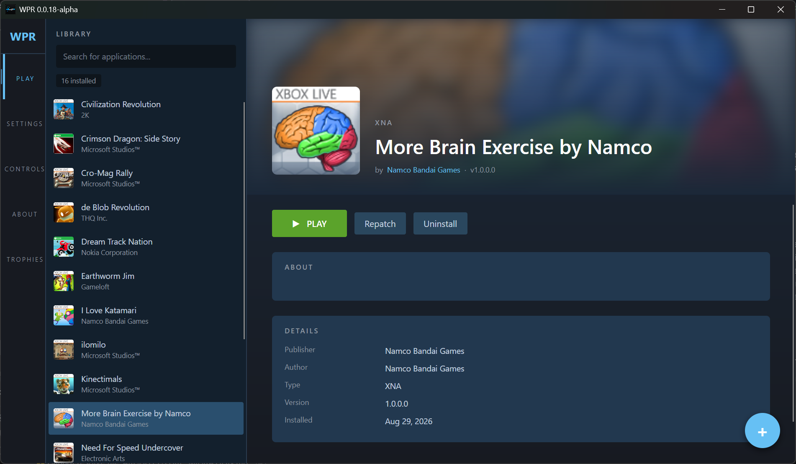
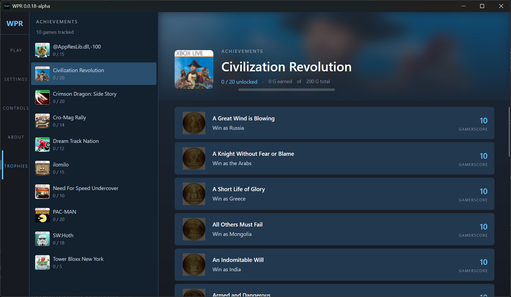
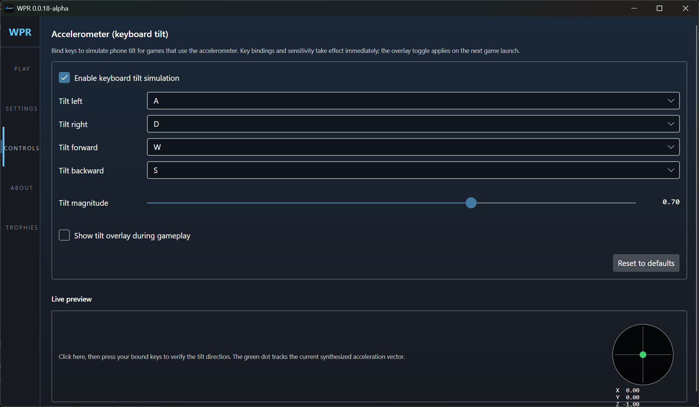
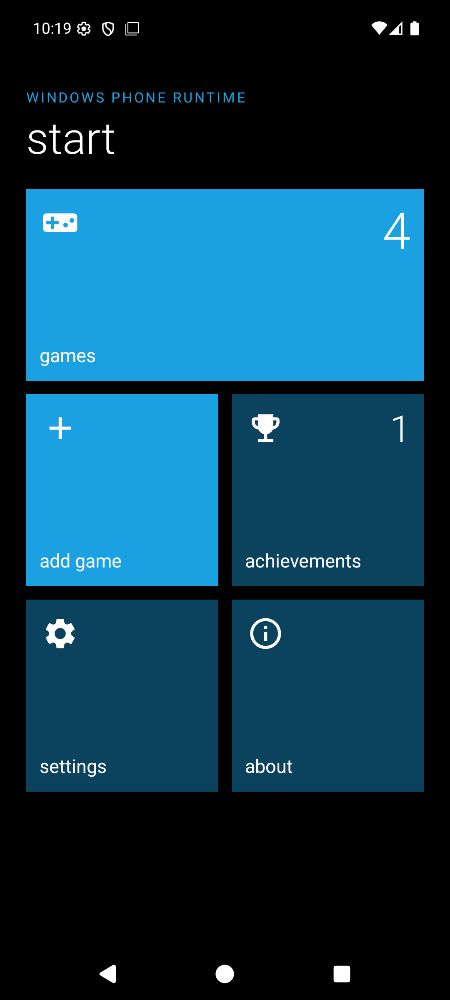
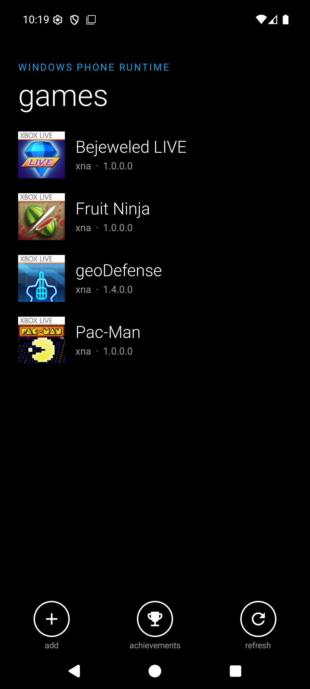
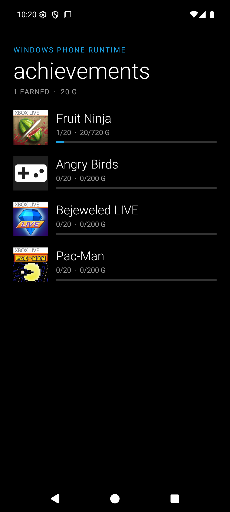

<div align="center">


# WPR — Windows Phone Runner

**Play your old Windows Phone games again, on a PC or an Android phone.**

`0.1.*` · [Compatibility list](https://bubbleshum.github.io/WPR/) · [MIT licensed](LICENSE)

</div>

---

## What is this?

Windows Phone is gone, and the games that were on it went with it. Titles like
*Fruit Ninja*, *Pac-Man CE DX*, *ilomilo* and hundreds of others were only ever
released for a phone you can't buy any more, and they've never been re-released
anywhere else.

WPR brings them back. Point it at a game file you already own, click **Install**,
and it appears in your library ready to play — with its Xbox achievements
intact.

Dozens play end to end today, among them *ilomilo*, *Mirror's Edge*, *Plants vs.
Zombies*, *Fruit Ninja*, *Kinectimals*, *Skulls of the Shogun*, *PAC-MAN* and
*Sonic the Hedgehog 4*. The
[compatibility list](https://bubbleshum.github.io/WPR/) tracks every game that's
been tried, and how far it gets.

It isn't an emulator in the usual sense. It doesn't pretend to be a phone;
instead it takes the game's original program files and rewires the parts that ask
for Windows Phone features so they talk to modern replacements instead. The game
then runs directly on your machine, at your screen's resolution and speed.

> **This is early software.** It's a hobby project, it's still being actively
> rebuilt underneath, and plenty of games don't work yet. If you want something
> polished and finished, this isn't it — yet.

## What it looks like

### On Windows

Your library, with box art, achievements and one-click launching:



Achievements are tracked per game and saved between sessions:



Many phone games are steered by tilting the handset. On a PC you bind those tilts
to keys, with a live preview so you can check which way is which:



### On Android

The Android app keeps the Windows Phone look on purpose — the tile Start screen
will be familiar if you ever owned one:

<p align="center">
  
  
  
</p>

## Features

| | |
| --- | --- |
| 🎮 **Runs the original games** | Unmodified Windows Phone 7/8 game files — no patched or repacked copies needed |
| 🏆 **Xbox achievements** | 277 games ship with full achievement catalogues. Unlocks are saved between sessions and pop up as you earn them, on Windows and Android alike |
| 📌 **Pin a game to your home screen** | On Android, long-press a game in your library and it gets its own launcher icon, with that game's tile art — tapping it goes straight into the game |
| 🎵 **The original soundtracks** | Phone games shipped their music in a format nothing else plays. WPR converts it as you install, so games that would otherwise be silent keep their soundtrack |
| 📱 **Tilt controls** | On Android, the phone's real accelerometer. On a PC, bind the four tilt directions to keys, with adjustable strength, a live preview and an optional on-screen dial |
| 👆 **Touch games, on a keyboard** | Draw a tap or a swipe on a to-scale phone outline, bind it to a key, and play a touch-only game on a desktop. Set per game, and it works before you've even launched it |
| 🖱️ **The mouse wheel scrolls** | Long lists in phone games expect a flick. The wheel now does it, instead of a short drag being read as a tap |
| 📳 **Rumble** | Games that buzzed on the phone buzz again on Android, with a switch in settings to turn it off |
| 🖥️ **Windows and Android** | Runs on a desktop PC and on an Android phone or tablet |
| 🗂️ **A real library** | Box art, publisher, search, and install / repatch / uninstall per game |
| 👤 **A gamer profile** | Set a gamertag, a gamer picture and an accent colour — games that ask for them get real answers instead of blanks |
| 🔄 **The right way up** | Landscape games get a landscape screen and fill it, rather than being squeezed upright into a letterboxed box |
| 🕹️ **Several kinds of game** | XNA games (the best supported), Silverlight games, games that mix the two, GameMaker exports, and a rail for launching rebuilt native ports |
| 🛟 **Gets itself out of trouble** | If a game on Android dies before it draws anything, WPR notices and quietly starts the next one on a safer graphics mode — and you can pick one yourself in settings |
| 📝 **Diagnostics that help** | A per-game log written on every launch, so problems can actually be reported |
| 📦 **Nothing else to install** | The Windows installer bundles the .NET runtime and every native library the games need |

What changed in each release is in [`Docs/ReleaseNotes/`](Docs/ReleaseNotes), and older
history is on the
[Update History wiki page](https://github.com/Bubbleshum/WPR/wiki/Update-History).

## Getting WPR

### Download

If a release has been published, the
[Releases page](https://github.com/Bubbleshum/WPR/releases) has:

- `WPR-Setup-<version>.exe` — Windows installer, 64-bit. Everything is bundled;
  you don't need to install anything else first.
- `WPR-<version>.apk` — Android, for sideloading.

### Will it run on my device?

| | Works on | Won't run on |
| --- | --- | --- |
| **Windows** | Windows 10 version 1809 (October 2018) or newer, and Windows 11 — **64-bit Intel or AMD** | 32-bit Windows, and Windows on ARM (no ARM build yet) |
| **Android** | **Android 7.0 (Nougat) or newer**, on a **64-bit** device — in practice anything from about 2016 onward | Android 6.0 and older; 32-bit-only phones |

**Almost every Android phone and tablet made since 2016 qualifies** — 64-bit chips
were standard well before then. The awkward case is a very cheap phone, where
32-bit-only chips lingered for years after that. On one of those the app refuses
to install rather than installing and then misbehaving, so you'll know straight
away rather than wondering.

Intel Android devices (some Chromebooks, and the Android emulator) are supported
too.

**Still on Android 5 or 6?** Stay on
[0.1.05](https://github.com/Bubbleshum/WPR/releases) — it keeps working. Newer
releases run on a .NET engine that isn't offered for those versions.

### Build it yourself

You need the [.NET 10 SDK](https://dotnet.microsoft.com/download/dotnet/10.0) —
that's it for the desktop app. Then:

```bash
git clone https://github.com/Bubbleshum/WPR.git
cd WPR
dotnet build Src/Platforms/WPR.Platform.Windows/WPR.Platform.Windows.csproj -c Debug
```

The app appears at
`Src/Platforms/WPR.Platform.Windows/bin/Debug/net8.0-windows10.0.17763.0/WPR.Platform.Windows.exe`.

If you'd rather have a packaged build, there's a script that does it in one go:

```powershell
.\build-desktop.ps1 -Configuration Debug -Run
```

Working in an IDE? Open `Src/WPR.Windows.slnf` rather than the full solution — it
leaves out the Android-only projects, which need extra tooling.

Building the **Android** app needs more setup (the .NET Android workload, a JDK
and the Android SDK). That, and everything else about building, is in
[Docs/BUILDING.md](Docs/BUILDING.md).

### Adding a game

WPR doesn't come with any games — you supply your own. On Windows, point it at a
folder of game files and it lists what it finds; on Android, use **add game** and
pick the file. Either way, **Install** unpacks and prepares the game once, and
after that it's in your library.

## Which games work?

There's a searchable, sortable
**[compatibility list](https://bubbleshum.github.io/WPR/)** with box art, showing
what's known to run and what isn't.

Broadly: XNA games are the best-supported and most work. Silverlight games, and
games that mix Silverlight with XNA, are newer ground — several play properly now
and the rest get further than they used to, but it's still the rougher half of the
library. Unity games can't be run directly at all; they need a one-off rebuild
first, and only a couple exist. Later Windows Phone 8 apps written in C++ aren't
supported and won't be.

## Things to know

- **It's early, and it's mid-rebuild.** The `main` branch isn't guaranteed to
  build or run cleanly at any given moment — a large internal reorganisation is
  still in progress.
- **When a game fails, it's usually a missing piece rather than a broken app.**
  Each game leans on a slightly different set of phone features, and the ones it
  needs may not be reimplemented yet.
- **Android trails the desktop.** It builds and runs, but far fewer games have
  been tried there.
- **If you update WPR and a game suddenly stops working,** reinstall that game
  from inside WPR. Games are prepared once when installed, so a change to how
  that preparation works doesn't reach a game that's already set up.
- **No support is offered.** This is a spare-time project, shared as-is.

## Documentation

| Where | What's in it |
| --- | --- |
| [Docs/ReleaseNotes/](Docs/ReleaseNotes) | What changed in each release, in plain language |
| [Docs/](Docs/README.md) | Technical reference — [how it works](Docs/ARCHITECTURE.md), [building](Docs/BUILDING.md), [releasing](Docs/RELEASING.md) |
| [Plans/](Plans/README.md) | Design work in progress — the architecture migration, stage scopes, feasibility studies, TODO lists |
| [CLAUDE.md](CLAUDE.md) | Working conventions and gotchas for anyone editing the code |

## Credits

This is a fork of the original [WPR](https://github.com/8212369/WPR), heavily
rebuilt for modern .NET.

- [mediaexplorer74/WPR](https://github.com/mediaexplorer74/WPR) — the fork this
  one is based on; foundational Avalonia port work, Android groundwork, and the
  long-running R&D that made everything downstream possible
- [Tyler Jaacks](https://github.com/TylerJaacks) — .NET 5/6 → .NET 8 upgrade
- [Hector47](https://github.com/Hector47) — online services groundwork
- [fallaciousreasoning](https://github.com/fallaciousreasoning) - fixing the android build

Related forks worth a look:
[TylerJaacks/WPR](https://github.com/TylerJaacks/WPR) (branches `net8_upgrade`,
`dotnet_upgrade`), [Hector47/WPR](https://github.com/Hector47/WPR) (GameServices
ideas), and
[yangzhongke/Windows-Phone-Emulator](https://github.com/yangzhongke/Windows-Phone-Emulator)
(Silverlight-era reference implementations of the Windows Phone controls).

## Licence

[MIT](LICENSE). Provided as-is, with no warranty and no support.
